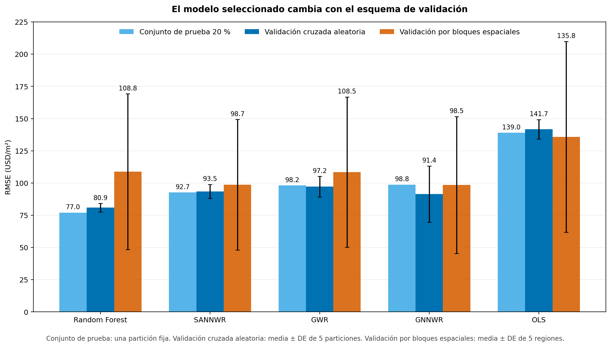

# Modelos del precio del suelo urbano del DMQ bajo validación aleatoria y espacial

[](https://github.com/faustoaguanor/dmq-land-value-spatial-x-validation/actions/workflows/quality.yml)
[](LICENSE)
[](https://www.python.org/)

Código y resultados agregados de la tesis:

> **Evaluación comparativa de modelos predictivos del precio de oferta del suelo urbano bajo esquemas de validación aleatoria y espacial en el Distrito Metropolitano de Quito**

**Autor:** Fausto Alejandro Guano Rojas<br>
**Programa:** Maestría en Ciencia de Datos, Yachay Tech<br>
**Área:** ciencia de datos geoespacial y valoración catastral<br>
**Datos de mercado:** 2024–2025

## Idea central

El repositorio compara cinco modelos (OLS, GWR, Random Forest, GNNWR y SANNWR) bajo esquemas de evaluación con separación geográfica creciente. El aporte no es una arquitectura nueva: es un protocolo reproducible que muestra que el modelo aparentemente ganador cambia cuando entrenamiento y prueba dejan de estar espacialmente entremezclados.



## Resultados principales

| Modelo | Conjunto de prueba RMSE | Validación cruzada aleatoria RMSE | Validación por bloques espaciales RMSE |
|---|---:|---:|---:|
| Random Forest | **76.99** | **80.9 ± 3.3** | 108.8 ± 60.4 |
| SANNWR | 92.70 | 93.5 ± 5.4 | 98.7 ± 50.6 |
| GWR | 98.15 | 97.2 ± 8.0 | 108.5 ± 58.3 |
| GNNWR | 98.76 | 91.4 ± 21.8 | **98.5 ± 53.1** |
| OLS | 139.01 | 141.7 ± 7.5 | 135.8 ± 74.1 |

Métricas en USD/m². El conjunto de prueba usa retransformación con *smearing* de Duan. En la validación por bloques espaciales, la dispersión corresponde a los cinco bloques territoriales; no debe confundirse con la variación entre semillas.

Hallazgos:

- Random Forest domina la interpolación, sin usar coordenadas.
- Al pasar del conjunto de prueba a la validación por bloques espaciales, su RMSE aumenta 41.3 % y cae al tercer puesto compartido.
- GNNWR encabeza la validación por bloques espaciales y es el único modelo competitivo que no se degrada respecto del conjunto de prueba.
- Con solo cinco regiones, la ventaja de GNNWR/SANNWR frente a Random Forest no alcanza significancia robusta: se reporta como tendencia, no como superioridad establecida.
- Ningún modelo elimina la autocorrelación residual.

Las tablas canónicas están en [`results/`](results/) y los resultados agregados de cada ejecución en [`results/raw/`](results/raw/). No se publican predicciones ni errores por predio.

## Revisión metodológica

Este repositorio incorpora, además del pipeline anterior, el código que responde
con evidencia ejecutable a las observaciones de un revisor formal de la tesis:
equivalencia estructural y numérica con las arquitecturas publicadas, alcance
de la fuga de imputación, homogeneidad del ajuste de hiperparámetros entre
modelos, tamaño efectivo de la muestra bajo autocorrelación espacial e
importancia de variables con colinealidad alta. Ver
[`revision_metodologica/README.md`](revision_metodologica/README.md) para el
detalle de cada observación y cómo reproducirla.

## Datos no incluidos

**Este repositorio no contiene datos prediales, coordenadas individuales, claves catastrales ni observaciones de investigación de mercado.** El conjunto utilizado combina información institucional cuya redistribución no está autorizada.

La reproducción numérica exacta requiere solicitar acceso a la **Dirección Metropolitana de Catastro del Municipio del Distrito Metropolitano de Quito**. Algunas capas vigentes o equivalentes pueden consultarse en los portales públicos municipales, pero pueden diferir de las versiones empleadas.

Consulta [`DATA_AVAILABILITY.md`](DATA_AVAILABILITY.md) para conocer las fuentes, fechas de corte y restricciones, y [`docs/data_dictionary.csv`](docs/data_dictionary.csv) para el contrato de variables.

## Estructura

```text
├── data_pipeline/       integración de las seis fuentes institucionales
├── data_split/          generación determinista del conjunto de prueba
├── spatial_cv/          validación aleatoria y bloques espaciales calibrados
├── modelos/             los cinco modelos comparados y las variantes de anexo
├── analisis/            inferencia, sensibilidad e interpretabilidad
├── eda/                 análisis exploratorio reproducible
├── figures/             scripts de figuras; sin datos cartográficos publicados
├── results/             tablas canónicas, métricas agregadas y figuras seguras
├── datos/README.md      contrato de datos, sin registros reales
├── tests/               controles de publicación y reproducibilidad
└── revision_metodologica/  respuesta a las observaciones de un revisor formal
```

## Instalación

Se recomienda Python 3.11 y un entorno aislado:

```bash
python -m venv .venv
# Linux/macOS
source .venv/bin/activate
# Windows PowerShell
.venv\Scripts\Activate.ps1

python -m pip install --upgrade pip
pip install -r requirements.txt
```

Para los modelos neuronales:

```bash
pip install -r requirements-gpu.txt
```

En equipos NVIDIA puede instalarse la rueda de PyTorch compatible con la versión local de CUDA siguiendo las instrucciones oficiales de PyTorch.

## Reproducción

### 1. Configurar los datos autorizados

```powershell
# Windows PowerShell
$env:DMQ_DATA_DIR = "D:\ruta\datos_autorizados"
```

```bash
# Linux/macOS
export DMQ_DATA_DIR=/ruta/datos_autorizados
```

### 2. Construir el dataset y las particiones

```bash
python data_pipeline/pipeline.py
python data_split/create_split.py
python spatial_cv/pipeline_bloques.py
python spatial_cv/check_spatial_separation.py
```

### 3. Ejecutar los cinco modelos

```bash
python modelos/ols/ols_log.py
python modelos/gwr/gwr_log_27vars.py
python modelos/baselines/baselines_tabulares.py
python modelos/gnnwr/gnnwr_log.py
python modelos/sannwr/sannwr_real_log.py
```

### 4. Réplicas y análisis

```bash
python modelos/baselines/baselines_tabulares_replicas.py
python modelos/gnnwr/gnnwr_log_replicas.py
python modelos/gnnwr/gnnwr_log_cv_replicas.py
python modelos/sannwr/sannwr_real_log_replicas.py
python modelos/sannwr/sannwr_real_log_cv_replicas.py
python analisis/analisis_log.py
python analisis/tost_equivalencia.py
python analisis/moran_significancia.py
```

El orden completo, semillas, hardware y contratos de salida se detallan en [`REPRODUCIBILITY.md`](REPRODUCIBILITY.md).

## Controles de calidad

Los controles públicos no necesitan los datos restringidos:

```bash
python -m compileall -q .
python -m unittest discover -s tests -v
```

La integración del conjunto integrado, la partición de prueba y los bloques se valida adicionalmente cuando los datos autorizados están disponibles.

## Uso responsable

Los modelos son evidencia metodológica y no un sistema oficial de avalúo. No deben usarse para asignar valores catastrales, obligaciones tributarias o decisiones individuales sin validación temporal, comparación con transacciones consumadas, auditoría territorial y revisión institucional humana.

El alcance, riesgos y escenarios de uso se resumen en [`docs/MODEL_CARD.md`](docs/MODEL_CARD.md).

## Citación y licencia

La cita completa está disponible en [`CITATION.cff`](CITATION.cff). El código propio se publica bajo licencia MIT. Esa licencia **no** se extiende a datos municipales, capas de terceros ni documentos institucionales, que no forman parte del repositorio.
